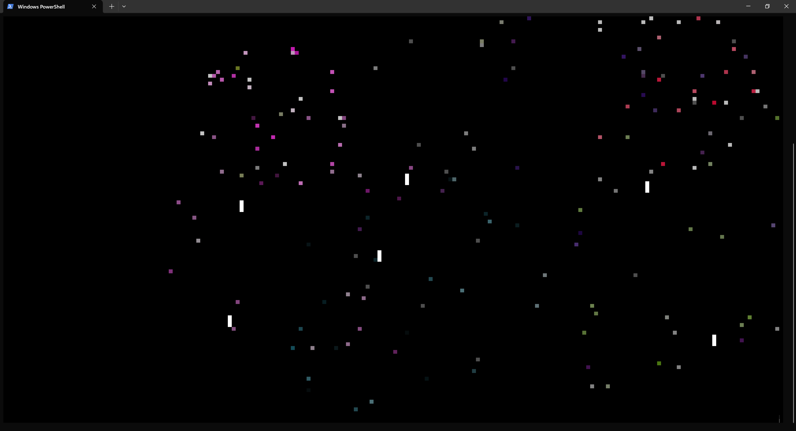

# terminal_fireworks

## 介绍

使用Rust编写的，可以在终端中模拟放烟花的场景，非常酷炫！

## 使用

```shell
cargo update
cargo run
```

## 效果



## 参考

- [Firework Particle Engine in the Terminal - Thank you for 1000 subscribers](https://www.youtube.com/watch?v=CHZYbPpI-OI)